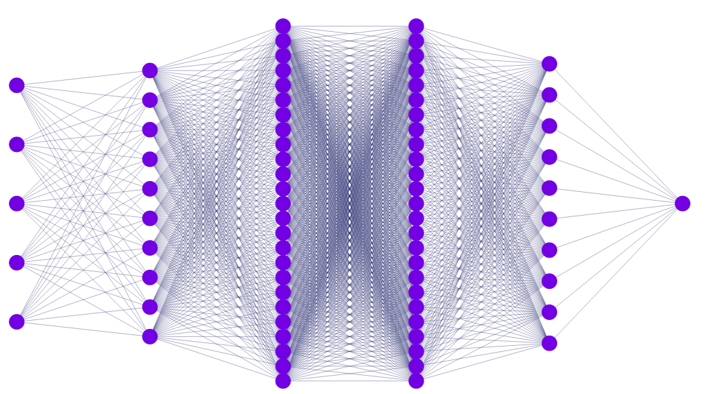

# Trabalho de RNA

Trabalho de RNA da disciplina de inteligência artificial utilizando como base de dados o dataset de massa mamográfica da UCI [[1]](http://archive.ics.uci.edu/ml/datasets/mammographic+mass).


Como temos 5 entradas e 2 classes, apenas um perceptron com 5 entradas + bias e 1 saída foi utilizado, como o diagrama abaixo ilustra:


<p align='center'>
    
</p>

## Execução

Para que o software execute, você precisa de instalar o numpy (única dependência):

```
pip install numpy
```

Para executar basta:

```
python3 main.py
```

## Outros testes

Para fazer uma tentativa com uma rede neural mais complexa, fiz uma rede profunda (relativamente exagerada) com o tensorflow (arquivo `main_tf.py`). O diagrama abaixo mostra a arquitetura utilizada (omitindo os dropouts):

<p align='center'>
    
</p>

Para executá-lo, instale antes o tensorflow (2+):

```
pip install tensorflow
```

E execute:

```
python3 main_tf.py
```

## Referências

* [1] http://archive.ics.uci.edu/ml/datasets/mammographic+mass